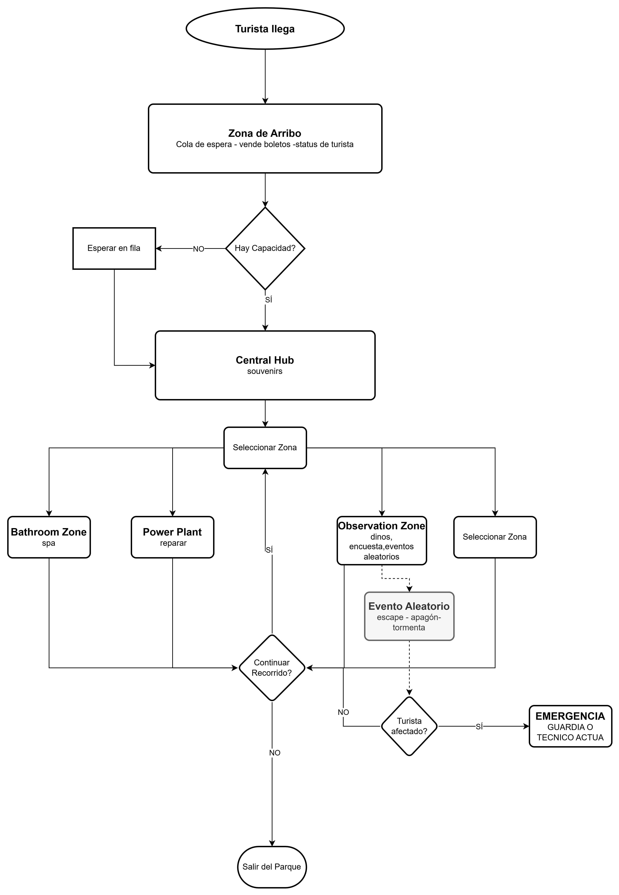

# DinoPark SAM
Administración y operación de un parque temarico.

## Herramientas Utilizadas

JAVA 17, spring-boot,LiquiBase,PostgreSql


## Instrucciones de configuracion

Para Ejecutar este proyecto

```bash
  mvn spring-boot:run
```

## Forma de ejecución del proyecto
    solo crear en postgresql una bd llamada "dinoparksam_bd"


## Descripcion del Sistema
Es un sistema de simulación secuencial de un parque turístico de dinosaurios, modelando el comportamiento de visitantes, trabajadores y dinosaurios en diferentes zonas, el parque contará con 5 zonas, cada una con actividades específicas con las que los turistas podrán interactuar, ya sea obteniendo algún souvenir, desatar un evento.
El sistema tendrá un sistema de monitreo para ver visitantes, ganancias de ellos, perdida o ganancias por los eventos aleatorios.

PD: Proyecto en desarrollo, en resources/imgs podra encontrar la idea en que me perdí, despues vi la guia del html en la reunicion del teams y vi que era muy diferente a lo que sea pedia. mi mente pensó en cosas complejas pero me enredé, sobreanalicé, entiendo que no puedo entregarlo fuera del plazo, pero lo terminaré lentamente, me gustó el proyecto que se planteó.


## Descripcion Diagramas
Diagrama de Flujo



